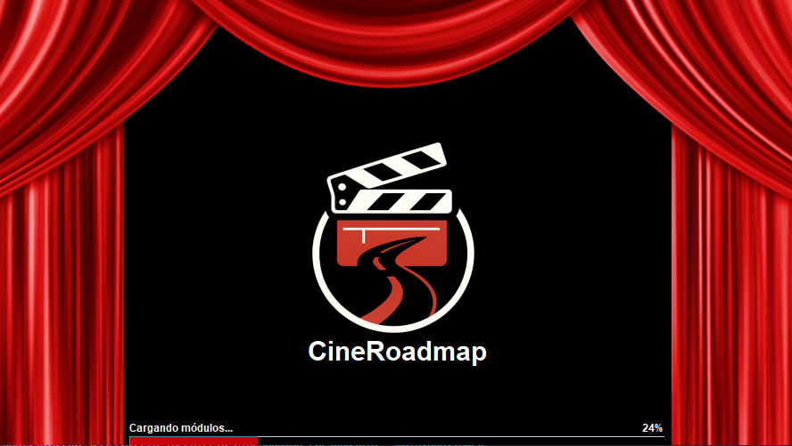
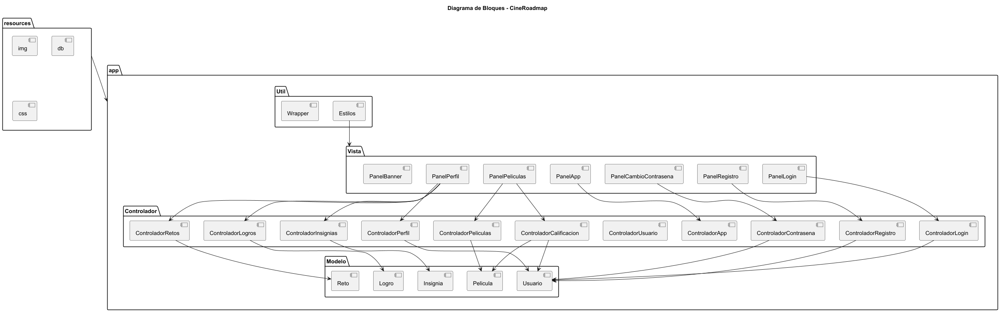
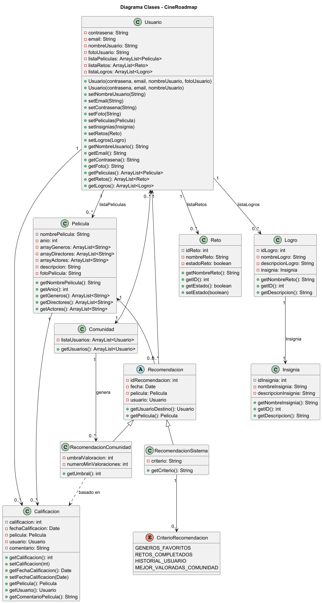
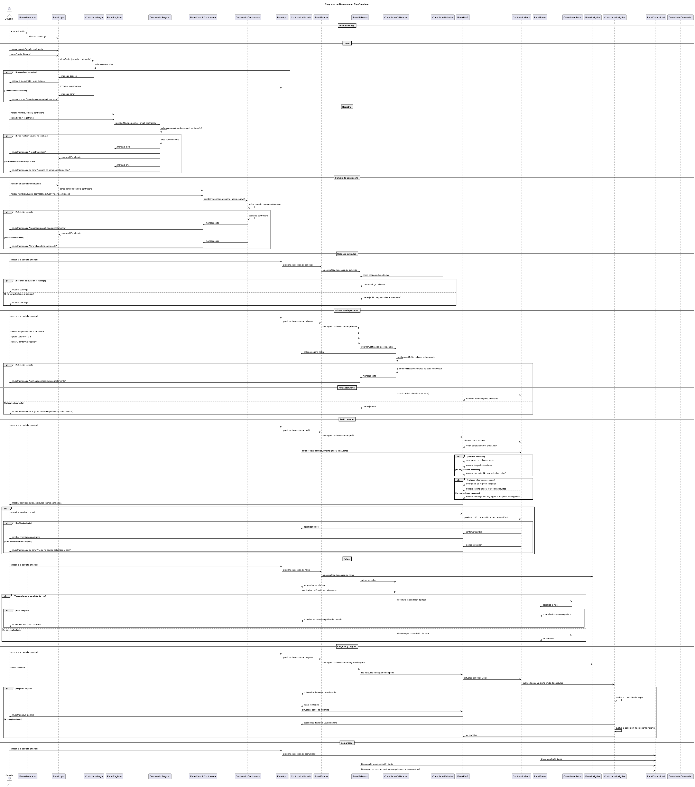
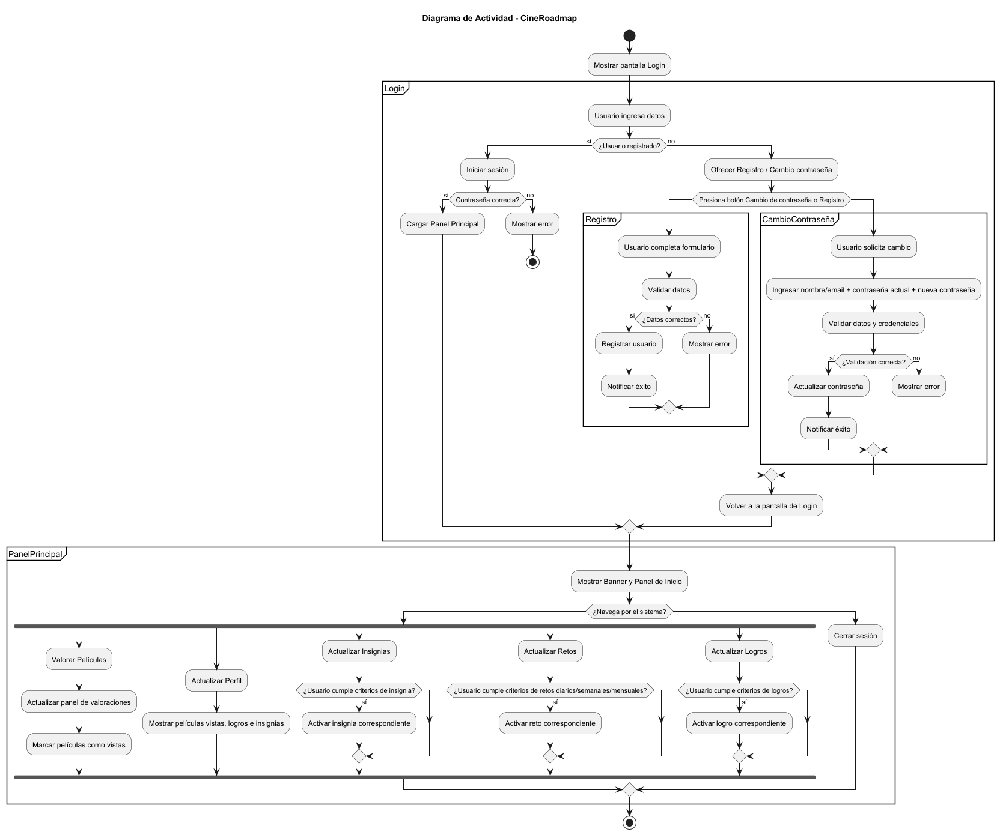
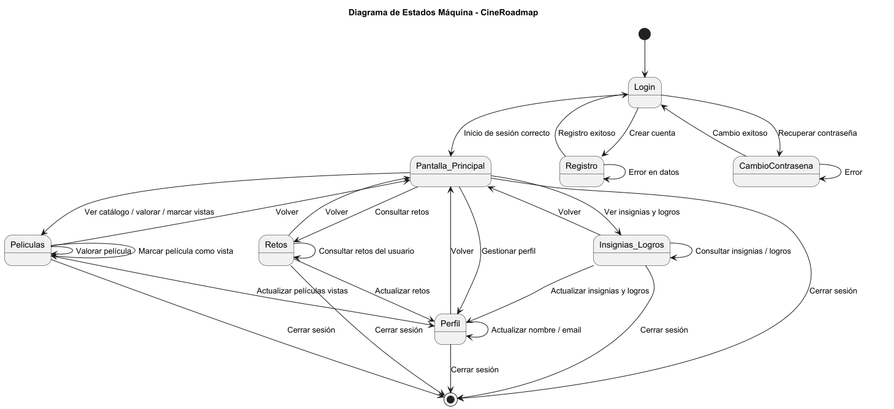

# 🎬 CineRoadmap – El reto final para los cinéfilos

**CineRoadmap** es una plataforma web gamificada que permite a los amantes del cine registrar las películas que han visto, desbloquear insignias y completar desafíos cinematográficos. Inspirada en los logros de videojuegos, promueve el descubrimiento fílmico y el espíritu comunitario entre cinéfilos.




## 📌 Tabla de Contenidos

- [Características principales](#caracteristicas_principales)
- [Perfil y comunidad](#perfil_y_comunidad)
- [Tecnologías utilizadas](#tecnologias_utilizadas)
- [Instalación y ejecución](#instalacion_y_ejecucion)
- [Estructura del proyecto](#estructura_del_proyecto)
- [Diagramas](#diagramas)
- [Próximos pasos](#proximos_pasos)
- [Licencia](#licencia)


## 🚀 Características principales <a name="caracteristicas_principales"></a> 

- Registro y consulta de películas vistas.
- Sistema de insignias por logros cinematográficos.
- Desafíos diarios/semanales que incentivan el hábito.
- Perfil con estadísticas, rachas y horas de visualización.
- Comparación con amigos y comunidad.

## 👤 Perfil y comunidad <a name="#perfil_y_comunidad"></a> 

- Lista de películas vistas.
- Insignias desbloqueadas.
- Estadísticas cinéfilas:
  - Películas totales
  - Racha más larga
  - Mes más productivo
  - Total de horas
- Comparte logros y progreso con amigos.


## 🛠️ Tecnologías utilizadas <a name="tecnologias_utilizadas"></a> 

- **Backend**: Java (desde `/src/main/app/Modelo` y `/src/main/app/Controlador`)
- **Frontend**: Java (desde `/src/main/app/Vista`)
- **Base de datos**: SQL o MySQL (con backup incluido)
- **Diagramas**: PlantUML (con IntelliJ IDEA)


## ⚙️ Instalación y ejecución <a name="instalacion_y_ejecucion"></a> 

### 🔧 Requisitos
- Java:
  - Extensions (VS Code)
  - Version 11+
- Eclipse: 
  - Java Version
- IntelliJ IDEA:
  - Versión Community Edition
  - PlantUML (Diseño de diagramas)

### 📦 Instalación

1. Clona el repositorio:

```bash
git clone git@github.com:Perales33/Proyecto_Ingenieria_CineRoadmap.git
cd Proyecto_Ingenieria_CineRoadmap
```
2. Verificar la versión de Java:

```
java -version
```

## 📁 Estructura del proyecto <a name="estructura_del_proyecto"></a> 
```bash
Proyecto_Ingenieria_CineRoadmap/
├── LICENSE
├── README.md
├── src/
│   └── main/
│       ├── app/
│       │   ├── Controlador/
│       │   ├── Modelo/
│       │   ├── Vista/
│       │   ├── util/
│       │   └── Main.java 
│       ├── resources/
│       │   ├── diagramas/
│       │   ├── img/
│       │   ├── db/
│       │   └── css/
└       └
```

## 🔮 Próximos pasos <a name="proximos_pasos"></a> 

- Migrar la aplicación a Java
- Desarrollar la aplicación para móvil
- Integración con APIs externas (IMDb o TMDB)
- Versión móvil (Android/iOS)
- Sincronización entre dispositivos
- Sistema de notificaciones

## 📐 Diagramas del proyecto <a name="diagramas"></a>

A continuación se incluyen los principales diagramas utilizados en el desarrollo de CineRoadmap. Estos ayudan a visualizar la arquitectura, el flujo de la aplicación y la estructura de clases.

### 📊 Diagrama de Arquitectura General


### 🧩 Diagrama de Clases (Modelo)


### 🔄 Diagrama de Casos de Uso


### 🗂️ Diagrama de Secuencia


### 🔧 Diagrama de Actividad


### 🔄 Diagrama de Máquina de Estados


## 📄 Licencia <a name="licencia"></a> 
Este proyecto está bajo la Licencia MIT. Consulta el archivo [LICENSE](LICENSE) para más detalles.